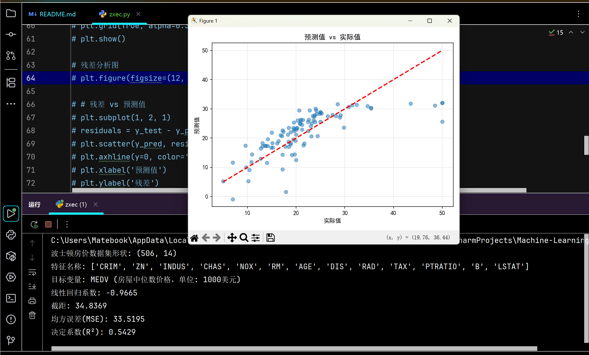

# Machine-Learning
机器学习
# 字段解释
波士顿房价数据集字段标识说明

字段名	字段说明	单位/范围	举例说明

CRIM	城镇人均犯罪率	每人犯罪率	0.00632表示每人的犯罪率

ZN	住宅区土地比例（超过25,000平方英尺）	比例	18表示18%的住宅用地超过25,000平方英尺

INDUS	非零售商业用地比例	比例	2.31表示2.31%的区域是非零售商业用地

CHAS	查尔斯河虚拟变量	0或1	0表示不靠近查尔斯河，1表示靠近

NOX	一氧化氮浓度	千万分之一	0.538表示53.8 ppm

RM	每户平均房间数	房间数	6.575表示平均每个住宅有6.575个房间

AGE	1940年前建造的自住单元比例	比例	65.2表示65.2%的自住单元建于1940年前

DIS	到五个波士顿就业中心的加权距离	加权距离	4.09表示加权距离为4.09

RAD	周边高速公路可达性指数	指数	1表示可达性低，12表示可达性高

TAX	全值财产税率（每10,000美元）	税率	296表示每10,000美元房产税为296美元

PTRATIO	学生与教师比例	比例	15.3表示每15.3个学生对应1个教师

B	城市种族多样性指数	指数	396.9表示种族多样性指数

LSTAT	低收入家庭比例	百分比	4.98表示4.98%的家庭属于低收入群体

MEDV	自住房屋中位数价格	1000美元	24表示房价中位数为24,000美元

## 重要说明
MEDV 是目标变量，表示房屋中位数价格，单位是1000美元（例如，MEDV=24表示房价为24,000美元）

数据集背景：该数据集来源于1970年波士顿标准都市统计区(SMSA)，包含506个样本（404个训练样本，102个测试样本）

历史背景：数据集最初由哈佛大学统计系的Thomas J. D. Cook于1978年发布，后来由Bache和Lichman整理进UCI机器学习库

数据特点：特征取值范围广泛，有些是比例（0-1），有些是整数（0-12），还有些是百分比（0-100）

